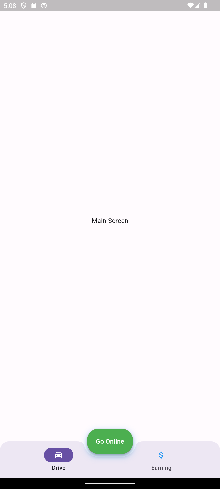
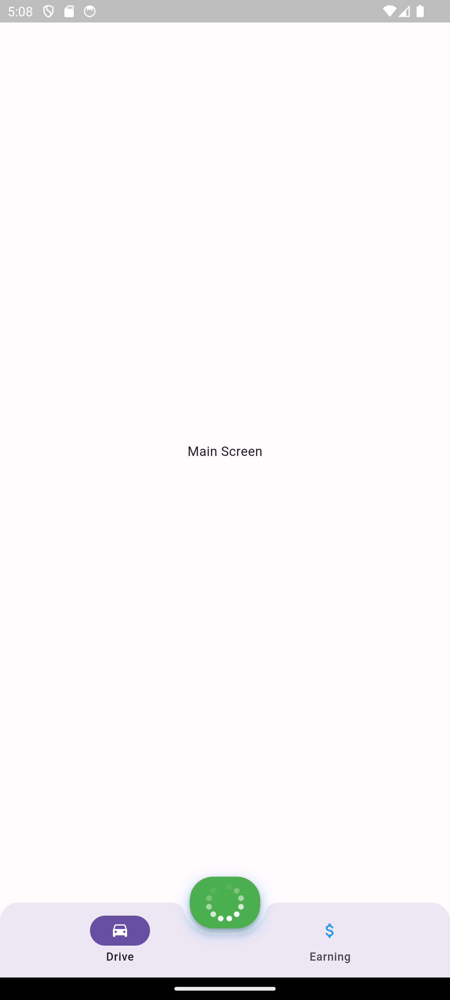
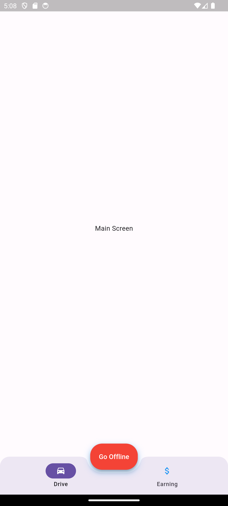

# Custom-Bottom-App-Bar

Custom-Bottom-App-Bar redefines the loading experience with its sleek design and user-friendly interface. This challenging two-hour project delivers optimized performance, customization options, and integrates valuable user feedback. Join a vibrant community pushing the boundaries of UI design. Elevate your app's loading game with Custom-Bottom-App-Bar!

<table style="width=100%">
  <tr>
    <td>
      <h4>1. Go Online State</h4>
      
    </td>
    <td>
      <h4>1. Go Loading State</h4>
      
    </td>
    <td>
      <h4>1. Go Offline State</h4>
      
    </td>
  </tr>
</table>

### Flutter Version : 3.16.9

## Code Preview

```dart
class CustomCircularNotchedRectangle extends NotchedShape {
  const CustomCircularNotchedRectangle();
  @override
  Path getOuterPath(Rect host, Rect? guest) {
    if (guest == null || !host.overlaps(guest)) {
      return Path()..addRect(host);
    }

    final double notchRadius = guest.width / 2.0;

    const double s1 = 15.0;
    const double s2 = 1.0;

    final double r = notchRadius;
    final double a = -1.0 * r - s2;
    final double b = host.top - guest.center.dy;

    final double n2 = math.sqrt(b * b * r * r * (a * a + b * b - r * r));
    final double p2xA = ((a * r * r) - n2) / (a * a + b * b);
    final double p2xB = ((a * r * r) + n2) / (a * a + b * b);
    final double p2yA = math.sqrt(r * r - p2xA * p2xA);
    final double p2yB = math.sqrt(r * r - p2xB * p2xB);

    final List<Offset?> p = List<Offset?>.filled(6, null);

    p[0] = Offset(a - s1, b);
    p[1] = Offset(a, b);
    final double cmp = b < 0 ? -1.0 : 1.0;
    p[2] = cmp * p2yA > cmp * p2yB ? Offset(p2xA, p2yA) : Offset(p2xB, p2yB);

    p[3] = Offset(-1.0 * p[2]!.dx, p[2]!.dy);
    p[4] = Offset(-1.0 * p[1]!.dx, p[1]!.dy);
    p[5] = Offset(-1.0 * p[0]!.dx, p[0]!.dy);

    for (int i = 0; i < p.length; i += 1) {
      p[i] = p[i]! + guest.center;
    }

    final Path path = Path()
      ..moveTo(host.left, host.top)
      ..lineTo(p[0]!.dx, p[0]!.dy)
      ..quadraticBezierTo(p[1]!.dx, p[1]!.dy, p[2]!.dx, p[2]!.dy);
    if (guest.height == guest.width) {
      path.arcToPoint(
        p[3]!,
        radius: Radius.circular(notchRadius),
        clockwise: false,
      );
    } else {
      path
        ..arcToPoint(
          guest.bottomLeft + Offset(guest.height / 2, 0),
          radius: Radius.circular(guest.height / 2),
          clockwise: false,
        )
        ..lineTo(guest.right - guest.height / 2, guest.bottom)
        ..arcToPoint(
          p[3]!,
          radius: Radius.circular(guest.height / 2),
          clockwise: false,
        );
    }
    path
      ..quadraticBezierTo(p[4]!.dx, p[4]!.dy, p[5]!.dx, p[5]!.dy)
      ..lineTo(host.right, host.top)
      ..lineTo(host.right, host.bottom)
      ..lineTo(host.left, host.bottom)
      ..close();
    return path;
  }
}
